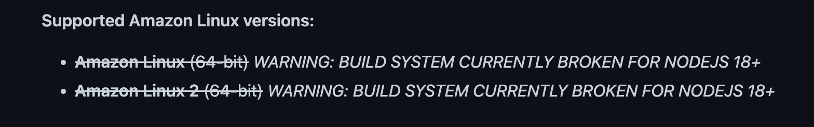

# Installing Node and Express on Amazon Linux on AWS EC2 Instance

This document describes the installation of node and express on Amazon Linux on an AWS EC2 instance.

*Primary source:* [Tutorial: Setting Up Node.js on an Amazon EC2 Instance](https://docs.aws.amazon.com/sdk-for-javascript/v2/developer-guide/setting-up-node-on-ec2-instance.html)

---

*Assumptions:* you are logged into the instance using ssh in Terminal.

*Important:* Amazon Linux 2 does not currently support the current LTS release (version 18.x) of Node.js. Use version 16.x instead.
From [NodeSource Node.js Binary Distributions](https://github.com/nodesource/distributions/blob/master/README.md#rpm):



Install the node version manager (nvm):

```curl -o- https://raw.githubusercontent.com/nvm-sh/nvm/v0.39.3/install.sh | bash```

Activate nvm:

```. ~/.nvm/nvm.sh```

Use nvm to install Node.js 16.x:

```nvm install 16```

Test that Node.js is installed:

```node -e "console.log('Running Node.js ' + process.version)"```

It should display:

```Running Node.js VERSION```


